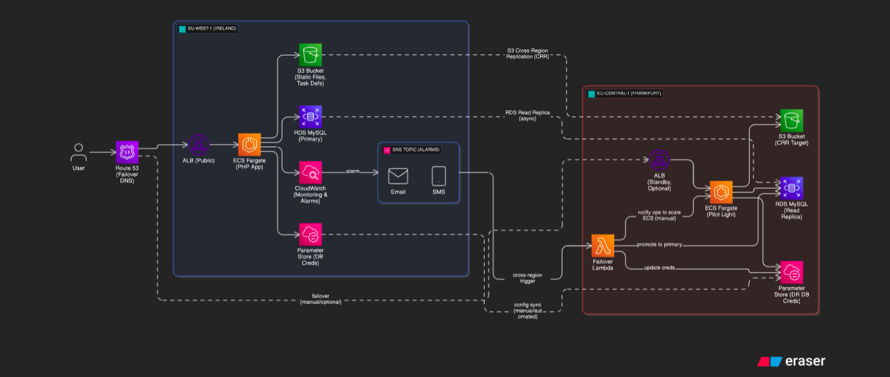

# 🔐 Highly Available LAMP Stack on Amazon ECS with Disaster Recovery

A PHP visit counter application deployed on **Amazon ECS Fargate** using **AWS Copilot** with **Disaster Recovery (DR)** capabilities across multiple AWS regions.

## Current Status

- ✅ PHP visit counter application (`index.php`)
- ✅ Docker containerization (`Dockerfile.app`)
- ✅ ECS deployment with AWS Copilot
- ✅ SSM Parameter Store integration for secrets
- ✅ RDS database integration
- ✅ Cross-region disaster recovery setup
- ✅ GitHub Actions CI/CD pipeline for automated DR

---

## 🧱 Architecture Overview

### 🌍 Primary Region

- **ECS Fargate**: Hosts containerized PHP visit counter app
- **RDS MySQL**: Primary database for visit tracking
- **Application Load Balancer**: Routes traffic to ECS tasks
- **SSM Parameter Store**: Securely stores database credentials
- **CloudWatch**: Monitors application and infrastructure metrics

### 🆘 Disaster Recovery (DR) Region

- **ECS (Pilot Light)**: Service deployed with `count: 0` (activated during DR)
- **RDS Read Replica**: Cross-region replica of primary database
- **GitHub Actions**: Automates DR failover process
- **CloudWatch Alarms**: Triggers DR automation on primary region failure
- **SNS**: Notification system for DR events



---

## 🚀 Deployment Guide

### 1. Prerequisites

- AWS CLI configured
- Docker installed
- AWS Copilot CLI installed

### 2. Initialize Copilot Application

```bash
copilot app init
copilot env init --name test --region <primary-region>
copilot env deploy --name test
```

### 3. Deploy Service

```bash
copilot svc init --name <service-name> --svc-type "Load Balanced Web Service"
copilot svc deploy --name <service-name> --env test
```

### 4. Configure Database Secrets

Create parameters in **AWS Systems Manager Parameter Store**:

```bash
# Database credentials (replace with actual values)
aws ssm put-parameter --name "/copilot/<service-name>/test/secrets/DB_HOST" --value "<rds-endpoint>" --type "String"
aws ssm put-parameter --name "/copilot/<service-name>/test/secrets/DB_USER" --value "<username>" --type "String"
aws ssm put-parameter --name "/copilot/<service-name>/test/secrets/DB_PASS" --value "<password>" --type "SecureString"
aws ssm put-parameter --name "/copilot/<service-name>/test/secrets/DB_NAME" --value "<database-name>" --type "String"
```

### 5. Service Manifest Configuration

```yaml
environments:
  test:
    secrets:
      DB_HOST: /copilot/<service-name>/test/secrets/DB_HOST
      DB_USER: /copilot/<service-name>/test/secrets/DB_USER
      DB_PASS: /copilot/<service-name>/test/secrets/DB_PASS
      DB_NAME: /copilot/<service-name>/test/secrets/DB_NAME
  dr:
    count: 0
    secrets:
      DB_HOST: /copilot/<service-name>/dr/secrets/DB_HOST
      DB_USER: /copilot/<service-name>/dr/secrets/DB_USER
      DB_PASS: /copilot/<service-name>/dr/secrets/DB_PASS
      DB_NAME: /copilot/<service-name>/dr/secrets/DB_NAME
```

---

## 🔄 CI/CD Pipeline for Disaster Recovery

This project includes GitHub Actions workflows that automate both deployment and disaster recovery:

### 1. Continuous Monitoring Workflow

The `monitor-and-dr.yml` workflow runs every 15 minutes to check application health:

- **Trigger**: Scheduled every 15 minutes or manual dispatch
- **Monitoring**: Checks ECS service CPU utilization in Ireland (eu-west-1)
- **Failure Detection**: Identifies when CPU utilization drops to 0 or service is inactive
- **Automatic Recovery**: Triggers DR process when failure is detected

### 2. Deployment and DR Workflow

The `deploy-and-dr.yml` workflow handles code deployments and DR activation:

- **Trigger**: Push to main branch or manual dispatch
- **Health Check**: Verifies Ireland region service health
- **DR Activation**: Automatically or manually triggered with `force_dr` parameter

### 3. DR Process Flow

When disaster recovery is triggered, the pipeline:

1. **Promotes RDS Read Replica** in Frankfurt to standalone database
2. **Updates Parameter Store** with new database endpoint
3. **Deploys Application** to Frankfurt ECS cluster with `count: 1`
4. **Sends Notification** via SNS about DR activation

### 4. Pipeline Architecture

```
Primary Region (Ireland)         DR Region (Frankfurt)
+-------------------+            +-------------------+
| ECS Service       |            | ECS Service       |
| (Active)          |  Failure   | (count: 0)        |
|                   | --------> |                   |
| RDS Database      |            | RDS Read Replica  |
| (Primary)         |            | (Promoted on DR)  |
+-------------------+            +-------------------+
        ^                                ^
        |                                |
        |                                |
+---------------------------------------+
|           GitHub Actions CI/CD         |
|  - Monitors CPU utilization           |
|  - Detects failures                   |
|  - Automates DR process               |
+---------------------------------------+
```

---

## ⚙️ Disaster Recovery Automation

### DR Trigger Flow

1. **GitHub Actions** detects ECS CPU utilization of 0 in primary region
2. **Workflow** executes DR procedures:
   - Promotes RDS read replica to standalone instance
   - Updates Parameter Store with new database endpoint
   - Scales ECS service from `count: 0` to `count: 1`
   - Sends notification of DR activation

---

## 🔐 Security Best Practices

- ✅ **No hardcoded credentials** - All secrets stored in SSM Parameter Store
- ✅ **Least privilege IAM roles** for ECS tasks and Lambda functions
- ✅ **VPC security groups** restrict database access to ECS tasks only
- ✅ **Encrypted storage** for RDS and Parameter Store SecureString values
- ✅ **Private subnets** for database and application tiers
- ✅ **Public repository safe** - No sensitive information exposed

---

## 📦 Project Structure

```
.
├── Dockerfile.app          # Container configuration
├── index.php              # PHP visit counter application
├── README.md              # Project documentation
├── .gitignore            # Git ignore rules
├── .github/workflows/    # GitHub Actions CI/CD pipelines
│   ├── deploy-and-dr.yml # Deployment and DR workflow
│   └── monitor-and-dr.yml # Scheduled monitoring workflow
└── copilot/              # AWS Copilot configurations (gitignored)
    ├── environments/
    └── <service-name>/
        └── manifest.yml
```

---

## 🔁 Future Enhancements

- [ ] **Route 53 Health Checks** for automatic DNS failover
- [ ] **S3 Cross-Region Replication** for static assets
- [ ] **CloudWatch Dashboards** for monitoring
- [x] **Automated testing** of DR procedures
- [ ] **Multi-AZ RDS deployment** for high availability
- [ ] **Auto Scaling** based on CPU/memory metrics

---

## 🧪 Testing Disaster Recovery

### Manual DR Test

1. **Simulate primary region failure**:

   ```bash
   # Stop RDS instance in primary region
   aws rds stop-db-instance --db-instance-identifier <primary-db-id>
   ```

2. **Monitor CloudWatch alarms** and GitHub Actions execution

3. **Verify DR activation**:

   ```bash
   # Check ECS service in DR region
   copilot svc show --name <service-name> --env dr
   ```

4. **Test application** using DR region load balancer URL

### Automated Testing

- Use GitHub Actions workflow with `force_dr: true` parameter
- Schedule regular DR drills using the monitoring workflow
- Implement RTO/RPO monitoring and alerting

---

## 📊 Monitoring and Observability

- **CloudWatch Metrics**: ECS task health, RDS performance
- **CloudWatch Logs**: Application logs and workflow execution logs
- **CloudWatch Alarms**: Database connectivity, high latency, error rates
- **GitHub Actions Logs**: DR activation and execution details

---

## 🚨 Recovery Objectives

- **RTO (Recovery Time Objective)**: < 15 minutes
- **RPO (Recovery Point Objective)**: < 5 minutes
- **Availability Target**: 99.9% uptime